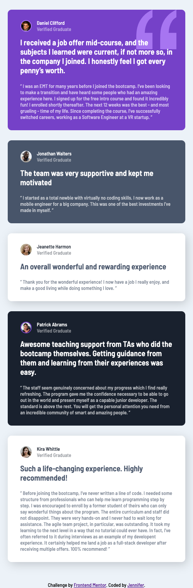
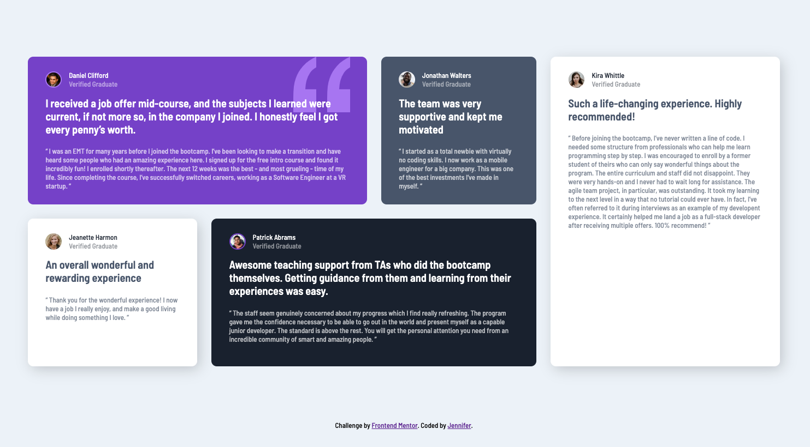

# Frontend Mentor - Testimonials grid section solution

## Table of contents

- [Overview](#overview)
  - [The challenge](#the-challenge)
  - [Screenshot](#screenshot)
  - [Links](#links)
- [My process](#my-process)
  - [Built with](#built-with)
  - [What I learned](#what-i-learned)
  - [Continued development](#continued-development)
  - [Useful resources](#useful-resources)
- [Author](#author)
- [Acknowledgments](#acknowledgments)

## Overview

### The challenge

[Testimonials grid section](https://www.frontendmentor.io/challenges/testimonials-grid-section-Nnw6J7Un7) is a challenge that helps users practice Responsive Design and Grid skills.

Users s hould be able to:
- [X] Complete the mobile layout
- [X] Complete the desktop layout
- [X] View the optimal layout for the site depending on their device's screen size

### Screenshot

 
 
 

### Links

- Solution URL: [My Solution](https://jennifer-464.github.io/front-end-activities/HTML-CSS-JS/Challenges/challenge4-junior-grid/)

## My process
I've been following a [Frontend Web Development Bootcamp Course](https://youtu.be/zJSY8tbf_ys?t=70846), but this time I wanted to attempt with minimal check ups on the video.

Last time I completed [Single price grid component](https://www.frontendmentor.io/challenges/single-price-grid-component-5ce41129d0ff452fec5abbbc) challenege, I was given feedback to study up on semantic HTML elements and CSS units. I did just that by paying close attention to the strucutre of my HTML semantic elements.

Once I completed my HTML structure, I resetted my HTML document and tried getting the general layout. After being satisfied with the layout, I added the individual styling. I completed it by tweaking small changes to make it similar to the designs given.

### Built with

- CSS display & position
- CSS Flex & Grid
- Media Queries
- Mobile-first workflow

### What I learned

I improved on using semantic elements and keeping clean code throughout.

### Continued development

I plan on continuing to take on more challenges on Frontend Mentor. I'd also like to get started on designing my portfolio through Figma and using the skills learned to build it from scratch. Animations is another topic I'd like to dive into once I have more solid foundational knowledge.

For my programming skills with JavaScript, I will occasionally dive into as I've been doing, but expanding my knowledge with DOM and JQuery.

### Useful resources

- [A Complete Guide to Flexbox](https://css-tricks.com/snippets/css/a-guide-to-flexbox/) - I often refer to this documentation about Flexbox. It contains good illustrations that helped me understand the purposes of different properties, especially with the parent-child relationship.

- [A Complete Guide to CSS Grid](https://css-tricks.com/snippets/css/complete-guide-grid/) - Same platform as flexbox that I will be referring to for Grid guidance.

## Author

- Website - [Jennifer](https://jennifer-464.github.io/front-end-activities/HTML-CSS-JS/Challenges/challenge4-junior-grid/)
- Frontend Mentor - [@Jennifer-464](https://www.frontendmentor.io/profile/Jennifer-464)

## Acknowledgments

Thank you so much to freeCodeCamp for providing a 21 hour long YouTube video on [Frontend Web Development](https://youtu.be/zJSY8tbf_ys).
