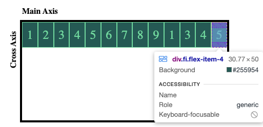

# Learning Flexbox

Refreshed understanding on basics of Flexbox, but I also learned new content such as flex-grow, flex-shrink, and flex-basis. I had to watch various videos on this as it was a bit hard to absorb the information. The way the YT video calculates step by step helped a lot!

Below it's a very basic layout of the container and boxes used to experiment with flex topics.

### Website Walkthrough GIF
 
